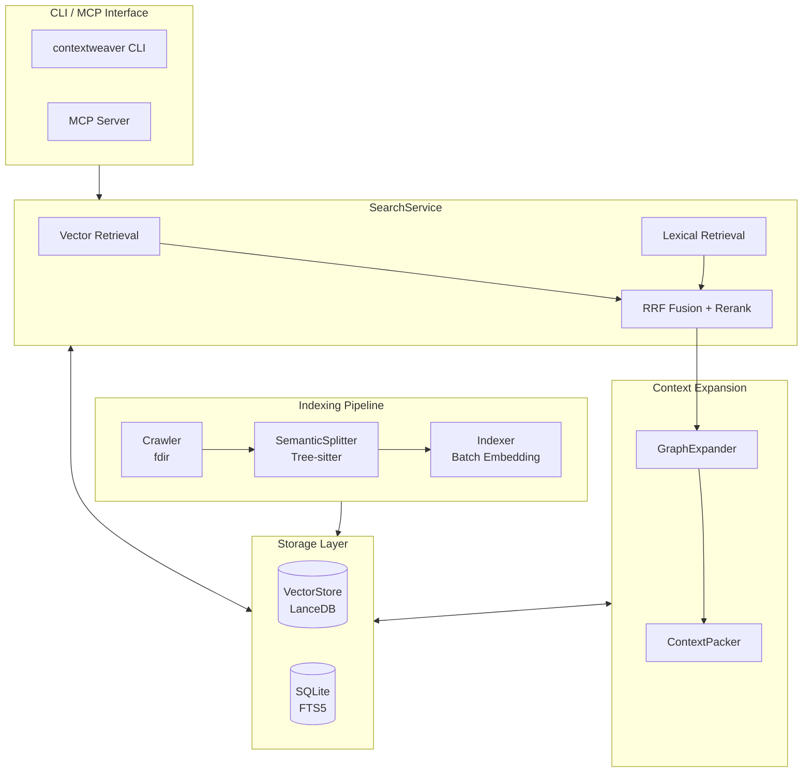

# ContextWeaver

<p align="center">
  <strong>🧵 为 AI Agent 精心编织的代码库上下文引擎</strong>
</p>

<p align="center">
  <em>Semantic Code Retrieval for AI Agents — Hybrid Search • Graph Expansion • Token-Aware Packing</em>
</p>

---

**ContextWeaver** 是一个专为 AI 代码助手设计的语义检索引擎，采用混合搜索（向量 + 词法）、智能上下文扩展和 Token 感知打包策略，为 LLM 提供精准、相关且上下文完整的代码片段。

<p align="center">
  
</p>

## ✨ 核心特性

### 🔍 混合检索引擎
- **向量召回 (Vector Retrieval)**：基于语义相似度的深度理解
- **词法召回 (Lexical/FTS)**：精确匹配函数名、类名等技术术语
- **RRF 融合 (Reciprocal Rank Fusion)**：智能融合多路召回结果

### 🧠 AST 语义分片
- **Tree-sitter 解析**：主包内置 JavaScript、Python、Go；其余语言通过可选插件扩展
- **Dual-Text 策略**：`displayCode` 用于展示，`vectorText` 用于 Embedding
- **Gap-Aware 合并**：智能处理代码间隙，保持语义完整性
- **Breadcrumb 注入**：向量文本包含层级路径，提升检索召回率

### 📊 三阶段上下文扩展
- **E1 邻居扩展**：同文件前后相邻 chunks，保证代码块完整性
- **E2 面包屑补全**：同一类/函数下的其他方法，理解整体结构
- **E3 Import 解析**：跨文件依赖追踪（可配置开关）

### 🎯 智能截断策略 (Smart TopK)
- **Anchor & Floor**：动态阈值 + 绝对下限双保险
- **Delta Guard**：防止 Top1 outlier 场景的误判
- **Safe Harbor**：前 N 个结果只检查下限，保证基本召回

### 🔌 MCP 原生支持
- **MCP Server 模式**：一键启动 Model Context Protocol 服务端
- **Zen Design 理念**：意图与术语分离，LLM 友好的 API 设计
- **自动索引**：首次查询自动触发索引，增量更新透明无感

## 📦 快速开始

### 环境要求

- Node.js >= 20 且 < 25（推荐 Node.js 22/24 LTS）
- npm >= 10

### 一、安装

#### 1) 简单安装

```bash
# 默认安装仅内置 JavaScript、Python、Go 的 AST 分片能力。
npm install -g @alistar.max/contextweaver
# 推荐安装全部语言插件： TypeScript、Kotlin、C#、C++、Java、Ruby、C、PHP、Rust、Swift
npm install -g @alistar.max/contextweaver-lang-all
```

> 如需更多语言支持，可通过**可选语言插件**按需安装。

### 二、使用

#### 1) 初始化配置

```bash
# 初始化配置文件（创建 ~/.contextweaver/.env）
contextweaver init
# 或简写
cw init
```

编辑 `~/.contextweaver/.env`，填入你的 API Key：

```bash
# Embedding API 配置（必需）
# 多 key（可选，逗号分隔）。与 EMBEDDINGS_API_KEY 兼容；同时配置时优先使用本项。
# EMBEDDINGS_API_KEYS=key-1,key-2
EMBEDDINGS_API_KEY=your-api-key-here
EMBEDDINGS_BASE_URL=https://api.siliconflow.cn/v1/embeddings
EMBEDDINGS_MODEL=BAAI/bge-m3
EMBEDDINGS_MAX_CONCURRENCY=10
EMBEDDINGS_DIMENSIONS=1024

# Reranker 配置（必需）
# 多 key（可选，逗号分隔）。与 RERANK_API_KEY 兼容；同时配置时优先使用本项。
# RERANK_API_KEYS=key-1,key-2
RERANK_API_KEY=your-api-key-here
RERANK_BASE_URL=https://api.siliconflow.cn/v1/rerank
RERANK_MODEL=BAAI/bge-reranker-v2-m3
RERANK_TOP_N=20

# 忽略模式（可选，逗号分隔,让AI生成不同语言项目的通用忽略文件）
# IGNORE_PATTERNS=.venv,node_modules
```


说明：

- `EMBEDDINGS_API_KEYS` / `RERANK_API_KEYS` 支持逗号分隔多 key。
- 与 `EMBEDDINGS_API_KEY` / `RERANK_API_KEY` 完全兼容。
- 若同时配置，多 key 变量优先，单 key 变量会作为兜底补充。

#### 2) MCP 集成配置

##### 2.1 Claude Desktop 配置

在 Claude CLI/OpenCode 中的配置文件中添加：

```json
{
  "mcpServers": {
    "contextweaver": {
      "command": "contextweaver",
      "args": ["mcp"]
    }
  }
}
```

##### 2.2 Codex CLI 配置

将以下内容添加到 `~/.codex/config.toml`：

```toml
[mcp_servers.contextweaver]
# 必备
type = "stdio"
command = "contextweaver"
args = ["mcp"]
# 可选
startup_timeout_sec = 20
tool_timeout_sec = 30
```

#### 3) 索引代码库

```bash
# 推荐手动在，在目标代码库根目录执行
cd /path/to/your/project
contextweaver index

# 指定路径[可选]
contextweaver index /path/to/your/project

# 强制重新索引[可选]
contextweaver index --force
```

#### 4) 本地搜索

```bash
# 语义搜索
cw search --information-request "用户认证流程是如何实现的？"

# 带精确术语
cw search --information-request "数据库连接逻辑" --technical-terms "DatabasePool,Connection"
```


### 三、测试

#### 1) 安装后 CLI 验证（不依赖 MCP 客户端）

如果你想验证“npm 包已安装 + 检索功能可用”，可以直接用当前仓库做一轮命令行自检：

```bash
# 1) 准备测试仓库
# 如果你当前就在本仓库目录，可跳过 clone
cd /tmp
git clone https://github.com/CodingOX/ContextWeaver.git
cd ContextWeaver

# 2) 确认 CLI 可执行
contextweaver --version

# 3) 初始化并配置 API Key（只需一次）
contextweaver init
# 编辑 ~/.contextweaver/.env，填 EMBEDDINGS_* 和 RERANK_*

# 4) 执行索引（首个项目/第一次使用建议手动执行 --force）
contextweaver index . --force

# 5) 执行检索验证
contextweaver search \
  --information-request "插件默认加载顺序在哪里定义" \
  --technical-terms "DEFAULT_PLUGIN_CANDIDATES,PluginLoader" \
  | tee /tmp/contextweaver-smoke.txt

# 6) 结果断言（命中即通过）
rg "PluginLoader\.ts|DEFAULT_PLUGIN_CANDIDATES" /tmp/contextweaver-smoke.txt
```

预期结果：

- `contextweaver --version` 能正常输出版本号
- 搜索结果中能命中 `PluginLoader.ts` 或 `DEFAULT_PLUGIN_CANDIDATES`

如果未命中，请优先检查：

- `~/.contextweaver/.env` 的 Embedding/Reranker 配置是否完整
- 网络是否可访问对应的 Embedding/Reranker API
- 是否已在目标仓库目录执行索引命令

#### 2) 安装常见问题（FAQ）

##### Q1：如何按需安装单语言插件？

- TypeScript：`npm install -g @alistar.max/contextweaver-lang-typescript`
- Kotlin：`npm install -g @alistar.max/contextweaver-lang-kotlin`
- C#：`npm install -g @alistar.max/contextweaver-lang-csharp`
- C++：`npm install -g @alistar.max/contextweaver-lang-cpp`
- Java：`npm install -g @alistar.max/contextweaver-lang-java`
- Ruby：`npm install -g @alistar.max/contextweaver-lang-ruby`
- C：`npm install -g @alistar.max/contextweaver-lang-c`
- PHP：`npm install -g @alistar.max/contextweaver-lang-php`
- Rust：`npm install -g @alistar.max/contextweaver-lang-rust`
- Swift：`npm install -g @alistar.max/contextweaver-lang-swift`
- TypeScript 5.8 兼容包（不推荐新安装）：`npm install -g @alistar.max/contextweaver-lang-ts21`
- TypeScript 5.9 兼容包（不推荐新安装）：`npm install -g @alistar.max/contextweaver-lang-ts22`

##### Q2：Node 24 能安装吗？

可以。当前版本支持 `Node.js >= 20 且 < 25`，包含 Node 24。
建议优先使用 Node 22/24 LTS。

##### Q3：不装插件会影响使用吗？

不会阻断索引和搜索。未安装插件时，对应语言会自动回退到纯文本分片。
只是 AST 结构化分片能力会降低，检索精度可能不如安装插件后。

##### Q4：作为 MCP 使用时，需要手动执行索引吗？新增文件会自动索引吗？

通常不需要手动执行 `contextweaver index`。
`codebase-retrieval` 在每次调用时都会先执行“自动索引检查”：

- 首次使用（项目未初始化）会自动执行一次完整索引。
- 后续调用会自动执行增量索引（新增/修改/删除文件会被检测并更新）。

所以新增文件一般会在“下一次 MCP 查询”时自动进入索引。

**但对于首个项目（第一次接入）强烈建议先手动执行一次索引**，避免把速率限制误判为“客户端卡住”：

```bash
contextweaver index . --force
```

这样你可以在终端直接观察 Embedding 进度与限流日志，并据此调整 `EMBEDDINGS_MAX_CONCURRENCY`。例如：

```text
2026-02-10 16:49:36 [INFO] Embedding 进度 {"progress":"492/773","percent":"64%","tokens":2215924,"elapsed":"8.5s","eta":"5s"}
2026-02-10 16:49:37 [WARN] 速率限制：触发 429，暂停所有请求 {"backoffMs":5000,"previousConcurrency":10,"newConcurrency":1,"activeRequests":6}
2026-02-10 16:49:42 [INFO] 速率限制：恢复请求 {"waitMs":10000}
2026-02-10 16:49:42 [INFO] Embedding 进度 {"progress":"538/773","percent":"70%","tokens":2419842,"elapsed":"14.5s","eta":"6s"}
2026-02-10 16:49:43 [WARN] 速率限制：触发 429，暂停所有请求 {"backoffMs":10000,"previousConcurrency":3,"newConcurrency":1,"activeRequests":2}
```

若出现索引异常或 Embedding 维度变化，可执行：

```bash
contextweaver index --force
```

> 注意：需先正确配置 Embedding/Reranker 环境变量，否则 MCP 会先提示配置，暂不执行索引。

#### 3) 项目回归测试（开发者）

```bash
# 语言支持与解析器回归
npm test

# MCP 多语言端到端冒烟测试
npm run test:e2e:mcp
```

### 四、发布（维护者）

如果你要一次性发布全部插件包（不含主包），可直接使用脚本：

```bash
# 先做发布前校验
npm install
npm test
npm run build
npm run --workspaces --if-present build

# 演练（不真正发布）
bash scripts/publish-plugins.sh --version 0.0.8 --dry-run

# 正式发布（会自动跳过 npm 上已存在的版本）
bash scripts/publish-plugins.sh --version 0.0.8
```

可选参数：

- `--tag <tag>`：指定 npm dist-tag（默认 `latest`）
- `--provenance`：强制附带 provenance（需支持 OIDC 的 CI）
- `--no-provenance`：禁用 provenance
- 不传 `--version`：按各插件目录下 `package.json` 的 version 发布

> provenance 默认是 auto：本地环境自动关闭，CI（含 OIDC）自动开启。
> 发布顺序与 CI 一致：单语言包 → `lang-all` → 兼容包（`lang-ts21`/`lang-ts22`）。
> 本地手动发版完整手册见：`docs/release/local-manual-release.md`

### 五、MCP 工具说明

ContextWeaver 提供一个核心 MCP 工具：`codebase-retrieval`

#### 1) 参数说明

| 参数 | 类型 | 必需 | 描述 |
|------|------|------|------|
| `repo_path` | string | ✅ | 代码库根目录的绝对路径 |
| `information_request` | string | ✅ | 自然语言形式的语义意图描述 |
| `technical_terms` | string[] | ❌ | 精确技术术语（类名、函数名等） |

#### 2) 设计理念 (Zen Design)

- **意图与术语分离**：`information_request` 描述「做什么」，`technical_terms` 过滤「叫什么」
- **黄金默认值**：提供同文件上下文，禁止默认跨文件抓取
- **回归代理本能**：工具只负责定位，跨文件探索由 Agent 自主发起

## 🏗️ 架构设计



### 核心模块说明

| 模块 | 职责 |
|------|------|
| **SearchService** | 混合搜索核心，协调向量/词法召回、RRF 融合、Rerank 精排 |
| **GraphExpander** | 上下文扩展器，执行 E1/E2/E3 三阶段扩展策略 |
| **ContextPacker** | 上下文打包器，负责段落合并和 Token 预算控制 |
| **VectorStore** | LanceDB 适配层，管理向量索引的增删改查 |
| **SQLite (FTS5)** | 元数据存储 + 全文搜索索引 |
| **SemanticSplitter** | AST 语义分片器，基于 Tree-sitter 解析 |

## 📁 项目结构

```
contextweaver/
├── src/
│   ├── index.ts              # CLI 入口
│   ├── config.ts             # 配置管理（环境变量）
│   ├── chunking/             # 语义分片
│   │   ├── SemanticSplitter.ts
│   │   ├── ParserPool.ts
│   │   └── runtime/
│   │       ├── LanguageRuntime.ts
│   │       ├── RuntimeRegistry.ts
│   │       ├── BuiltinRuntimeTs25.ts
│   │       └── PluginLoader.ts
│   ├── scanner/              # 文件扫描与处理
│   ├── search/               # 搜索核心与 import resolvers
│   ├── indexer/              # 批量索引逻辑
│   ├── vectorStore/          # LanceDB 适配层
│   ├── db/                   # SQLite + FTS5
│   ├── mcp/                  # MCP 服务端
│   └── utils/                # 日志/编码/锁等工具
├── packages/
│   ├── lang-all/             # 推荐：一键安装全部可选语言
│   ├── lang-typescript/      # 单语言插件示例（其余语言同模式）
│   ├── lang-rust/            # 单语言插件示例
│   ├── lang-ts21/            # 兼容插件（不推荐新安装）
│   └── lang-ts22/            # 兼容插件（不推荐新安装）
├── tests/
│   ├── language-support.test.ts
│   ├── runtime/
│   │   ├── registry.test.ts
│   │   ├── plugin-loader.test.ts
│   │   ├── workspace-packages.test.ts
│   │   └── docs-guard.test.ts
│   ├── install/
│   │   └── node24-smoke.mjs
│   └── mcp-e2e-smoke.ts
├── pnpm-workspace.yaml
├── package.json
└── tsconfig.json
```

## ⚙️ 配置详解

### 环境变量

| 变量名 | 必需 | 默认值 | 描述 |
|--------|------|--------|------|
| `EMBEDDINGS_API_KEYS` | ✅（与 `EMBEDDINGS_API_KEY` 二选一） | - | 多 Embedding API Key（逗号分隔）；与单 key 兼容，同时配置时优先使用本项 |
| `EMBEDDINGS_API_KEY` | ✅（与 `EMBEDDINGS_API_KEYS` 二选一） | - | 单 Embedding API Key（兼容写法）；同时配置时作为兜底补充 |
| `EMBEDDINGS_BASE_URL` | ✅ | - | Embedding API 地址 |
| `EMBEDDINGS_MODEL` | ✅ | - | Embedding 模型名称 |
| `EMBEDDINGS_MAX_CONCURRENCY` | ❌ | 10 | Embedding 并发数 |
| `EMBEDDINGS_DIMENSIONS` | ❌ | 1024 | 向量维度 |
| `RERANK_API_KEYS` | ✅（与 `RERANK_API_KEY` 二选一） | - | 多 Reranker API Key（逗号分隔）；与单 key 兼容，同时配置时优先使用本项 |
| `RERANK_API_KEY` | ✅（与 `RERANK_API_KEYS` 二选一） | - | 单 Reranker API Key（兼容写法）；同时配置时作为兜底补充 |
| `RERANK_BASE_URL` | ✅ | - | Reranker API 地址 |
| `RERANK_MODEL` | ✅ | - | Reranker 模型名称 |
| `RERANK_TOP_N` | ❌ | 20 | Rerank 返回数量 |
| `IGNORE_PATTERNS` | ❌ | - | 额外忽略模式 |

### 搜索配置参数

```typescript
interface SearchConfig {
  // === 召回阶段 ===
  vectorTopK: number;        // 向量召回数量（默认 30）
  vectorTopM: number;        // 送入融合的向量结果数（默认 30）
  ftsTopKFiles: number;      // FTS 召回文件数（默认 15）
  lexChunksPerFile: number;  // 每文件词法 chunks 数（默认 3）
  lexTotalChunks: number;    // 词法总 chunks 数（默认 30）

  // === 融合阶段 ===
  rrfK0: number;             // RRF 平滑常数（默认 60）
  wVec: number;              // 向量权重（默认 1.0）
  wLex: number;              // 词法权重（默认 0.5）
  fusedTopM: number;         // 融合后送 rerank 数量（默认 40）

  // === Rerank ===
  rerankTopN: number;        // Rerank 后保留数量（默认 10）
  maxRerankChars: number;    // Rerank 文本最大字符数（默认 1200）

  // === 扩展策略 ===
  neighborHops: number;      // E1 邻居跳数（默认 2）
  breadcrumbExpandLimit: number;  // E2 面包屑补全数（默认 3）
  importFilesPerSeed: number;     // E3 每 seed 导入文件数（默认 0）
  chunksPerImportFile: number;    // E3 每导入文件 chunks（默认 0）

  // === Smart TopK ===
  enableSmartTopK: boolean;  // 启用智能截断（默认 true）
  smartTopScoreRatio: number;     // 动态阈值比例（默认 0.5）
  smartMinScore: number;          // 绝对下限（默认 0.25）
  smartMinK: number;              // Safe Harbor 数量（默认 2）
  smartMaxK: number;              // 硬上限（默认 15）
}
```

## 🌍 多语言支持

ContextWeaver 当前采用“主包内置 + 可选插件”两层能力模型：

- 主包内置 AST：JavaScript、Python、Go
- 插件扩展 AST：TypeScript、Kotlin、C#、C++、Java、Ruby、C、PHP、Rust、Swift
- 未安装插件时：相关语言自动回退为纯文本分片（可索引，可搜索）

| 语言 | 主包默认 AST | 安装插件后 AST | Import 解析 | 文件扩展名 |
|------|--------------|----------------|-------------|-----------|
| JavaScript | ✅ | ✅ | ✅ | `.js`, `.jsx`, `.mjs` |
| Python | ✅ | ✅ | ✅ | `.py` |
| Go | ✅ | ✅ | ✅ | `.go` |
| TypeScript | ❌ | ✅（`lang-all` 或 `lang-typescript`） | ✅ | `.ts`, `.tsx` |
| Kotlin | ❌ | ✅（`lang-all` 或 `lang-kotlin`） | ✅ | `.kt` |
| C# | ❌ | ✅（`lang-all` 或 `lang-csharp`） | ✅ | `.cs`, `.csx` |
| C++ | ❌ | ✅（`lang-all` 或 `lang-cpp`） | ✅ | `.cpp`, `.cc`, `.cxx`, `.hpp` |
| Java | ❌ | ✅（`lang-all` 或 `lang-java`） | ✅ | `.java` |
| Ruby | ❌ | ✅（`lang-all` 或 `lang-ruby`） | ✅ | `.rb` |
| C | ❌ | ✅（`lang-all` 或 `lang-c`） | ✅ | `.c`, `.h` |
| PHP | ❌ | ✅（`lang-all` 或 `lang-php`） | ✅ | `.php` |
| Rust | ❌ | ✅（`lang-all` 或 `lang-rust`） | ✅ | `.rs` |
| Swift | ❌ | ✅（`lang-all` 或 `lang-swift`） | ✅ | `.swift` |
| Dart | ❌ | ❌（当前无插件） | ✅ | `.dart` |

C# Import 解析支持 `using`、`using static`、`global using`、别名导入，
并兼容 `global::` 与 `@` 标识符写法。

## 🔄 工作流程

### 索引流程

```
1. Crawler     → 遍历文件系统，过滤忽略项
2. Processor   → 读取文件内容，计算 hash
3. Splitter    → AST 解析，语义分片
4. Indexer     → 批量 Embedding，写入向量库
5. FTS Index   → 更新全文搜索索引
```

### 搜索流程

```
1. Query Parse     → 解析查询，分离语义和术语
2. Hybrid Recall   → 向量 + 词法双路召回
3. RRF Fusion      → Reciprocal Rank Fusion 融合
4. Rerank          → 交叉编码器精排
5. Smart Cutoff    → 智能分数截断
6. Graph Expand    → 邻居/面包屑/导入扩展
7. Context Pack    → 段落合并，Token 预算
8. Format Output   → 格式化返回给 LLM
```

## 📊 性能特性

- **增量索引**：只处理变更文件，二次索引速度提升 10x+
- **批量 Embedding**：自适应批次大小，支持并发控制
- **速率限制恢复**：429 错误时自动退避，渐进恢复
- **连接池复用**：Tree-sitter 解析器池化复用
- **文件索引缓存**：GraphExpander 文件路径索引 lazy load

## 🐛 日志与调试

日志文件位置：`~/.contextweaver/logs/app.YYYY-MM-DD.log`

设置日志级别：

```bash
# 开启 debug 日志
LOG_LEVEL=debug contextweaver search --information-request "..."
```

## 📄 开源协议

本项目采用 MIT 许可证。

## 🙏 致谢

- [Tree-sitter](https://tree-sitter.github.io/tree-sitter/) - 高性能语法解析
- [LanceDB](https://lancedb.com/) - 嵌入式向量数据库
- [MCP](https://modelcontextprotocol.io/) - Model Context Protocol
- [SiliconFlow](https://siliconflow.cn/) - 推荐的 Embedding/Reranker API 服务

---

<p align="center">
  <sub>Made with ❤️ for AI-assisted coding</sub>
</p>
